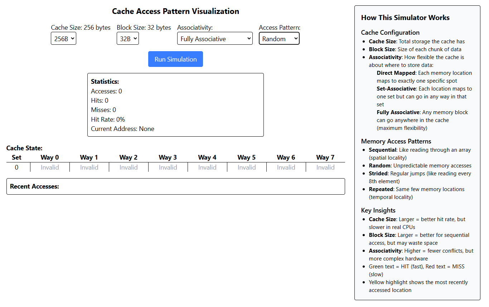

# Cache Memory Simulator

An interactive web-based visualization tool for understanding CPU cache behavior and memory access patterns.



## Overview

This project provides an educational tool for visualizing how different cache organizations (direct-mapped, set-associative, and fully associative) handle various memory access patterns. It helps computer science students and professionals understand the performance implications of cache design decisions.

## Features

- **Interactive Configuration**:
  - Adjustable cache size (128B, 256B, 512B)
  - Configurable block size (16B, 32B, 64B) 
  - Selectable associativity (direct-mapped, 2-way, 4-way, 8-way, fully associative)

- **Memory Access Patterns**:
  - Sequential access (spatial locality)
  - Random access
  - Strided access (regular patterns with jumps)
  - Repeated access (temporal locality)
  - Conflict Test (demonstrates associativity benefits)

- **Real-time Visualization**:
  - Color-coded hits and misses
  - Cache state display showing tags and validity
  - Access history with hit/miss indicators
  - Performance statistics

- **Automatic Comparison Test**:
  - Runs direct-mapped vs. fully associative comparison
  - Shows hit rate improvement statistics

## How It Works

The simulator models the key components of a CPU cache:
- **Sets and Ways** - Organized according to associativity
- **Tags and Valid Bits** - For tracking cached memory blocks
- **LRU Replacement Policy** - For selecting which blocks to evict

When memory is accessed, the simulator:
1. Calculates the set index and tag from the address
2. Checks if the data is in the cache (hit) or not (miss)
3. Updates the cache state and statistics
4. Visualizes the operation

## Educational Value

This simulator helps demonstrate important cache concepts:
- How associativity affects hit rate
- The impact of different access patterns on performance
- The trade-offs between cache size, associativity, and complexity
- How spatial and temporal locality influence cache effectiveness

## Getting Started

1. Clone the repository
   ```
   git clone https://github.com/yourusername/cache-simulator.git
   cd cache-simulator
   ```

2. Install dependencies
   ```
   npm install
   ```

3. Start the development server
   ```
   npm run dev
   ```

4. Open your browser to `http://localhost:3000`


## License

MIT License

## Contributing

Contributions are welcome! Please feel free to submit a Pull Request.
